## Samples Videos

||||
| :-----: | :-: | :-: |
|  [bolt-detection.mp4](https://github.com/intel-iot-devkit/sample-videos/raw/master/bolt-detection.mp4) |  [bolt-multi-size-detection.mp4](https://github.com/intel-iot-devkit/sample-videos/raw/master/bolt-multi-size-detection.mp4) | 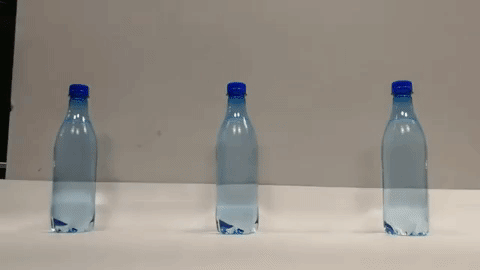 [bottle-detection.mp4](https://github.com/intel-iot-devkit/sample-videos/raw/master/bottle-detection.mp4) |
| 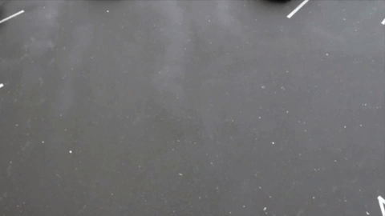 [car-detection.mp4](https://github.com/intel-iot-devkit/sample-videos/raw/master/car-detection.mp4) |  [classroom.mp4](https://github.com/intel-iot-devkit/sample-videos/raw/master/classroom.mp4) | 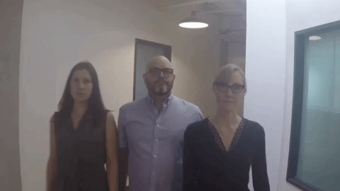 [face-demographics-walking-and-pause.mp4](https://github.com/intel-iot-devkit/sample-videos/raw/master/face-demographics-walking-and-pause.mp4) |
| 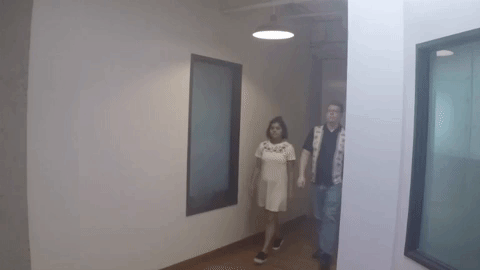 [face-demographics-walking.mp4](https://github.com/intel-iot-devkit/sample-videos/raw/master/face-demographics-walking.mp4) | 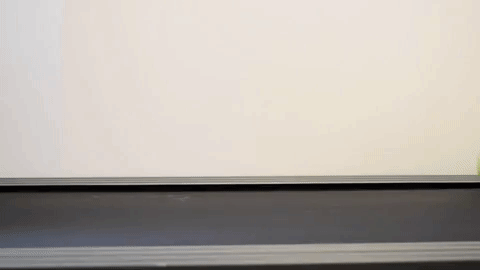 [fruit-and-vegetable-detection.mp4](https://github.com/intel-iot-devkit/sample-videos/raw/master/fruit-and-vegetable-detection.mp4) | 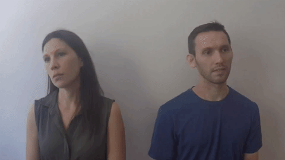 [head-pose-face-detection-female-and-male.mp4](https://github.com/intel-iot-devkit/sample-videos/raw/master/head-pose-face-detection-female-and-male.mp4) |
| 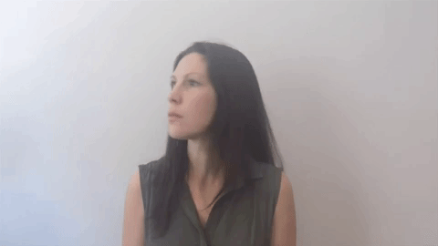 [head-pose-face-detection-female.mp4](https://github.com/intel-iot-devkit/sample-videos/raw/master/head-pose-face-detection-female.mp4) | 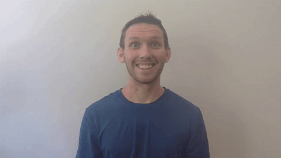 [head-pose-face-detection-male.mp4](https://github.com/intel-iot-devkit/sample-videos/raw/master/head-pose-face-detection-male.mp4) | 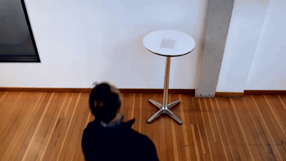 [one-by-one-person-detection.mp4](https://github.com/intel-iot-devkit/sample-videos/raw/master/one-by-one-person-detection.mp4) |
| 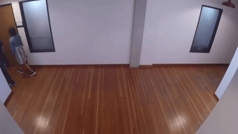 [people-detection.mp4](https://github.com/intel-iot-devkit/sample-videos/raw/master/people-detection.mp4) | 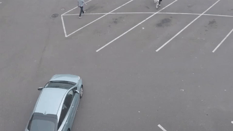 [person-bicycle-car-detection.mp4](https://github.com/intel-iot-devkit/sample-videos/raw/master/person-bicycle-car-detection.mp4) |  [store-aisle-detection.mp4](https://github.com/intel-iot-devkit/sample-videos/raw/master/store-aisle-detection.mp4) |
| 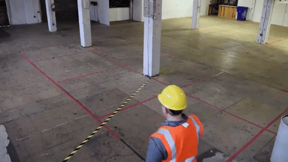 [worker-zone-detection.mp4](https://github.com/intel-iot-devkit/sample-videos/raw/master/worker-zone-detection.mp4) |||
